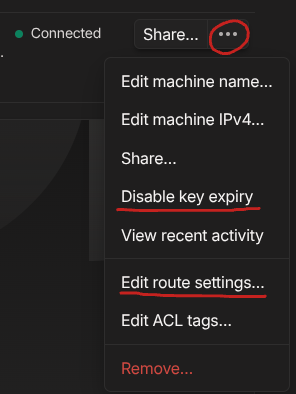
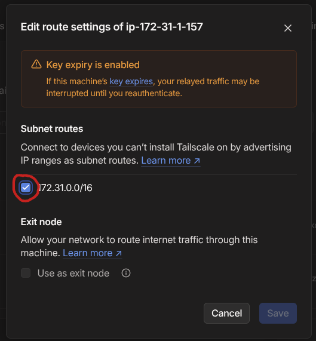
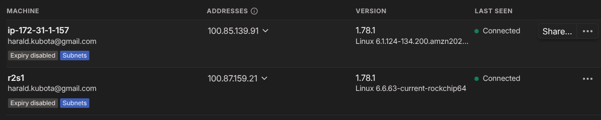

# Using TF (OpenTofu) to create a site-to-site VPN with AWS

The example creates:

* A new VPC
* A list of public and private subnets in each availability zone
* an EC2 instance with Linux in a public subnet in the first AZ
* an EC2 instance with Linux in that private subnet in the first AZ
* a Cloudflare DNS entry for the public Tailscale host

## Pre-Requisites

* a network at home (AKA on-premise)
* a machine on the on-premise network which is in Tailscale and which advertises the local network. My IP for this one is 192.168.4.39.
* AWS CLI installed and configured
* OpenTofu installed
* Update provider.tf with your account ID
* Update the ssh key you want to use in ssh-key.tf
* Update terraform.tfvars to your liking (in particular: region and IPs)
* a .env file containing API tokens for Cloudflare, like:
```
export TF_VAR_cloudflare_dns_id="YOUR_ZONE_ID"
export TF_VAR_cloudflare_api_token="YOUR_API_TOKEN"
```


## Using OpenTofu to build AWS Infrastructure

Build the infrastructure in AWS:

```
❯ source .env
❯ tofu -chdir=tailscale workspace select prod
❯ tofu -chdir=tailscale apply -auto-approve
[...]

Outputs:

cloudflare_dns = "tsgw-prod.qw2.org"
instance_ips = "ec2-13-112-16-13.ap-northeast-1.compute.amazonaws.com"
```

You now have 2 EC2 instances: one in a private network (10.8.2.0/24)
which is the representative of all EC2
instances in private subnets,
and one in a public subnet (10.8.1.0/24) which is the Tailscale gateway.

Connect to the AWS Tailscale gateway with the SSH key you supplied (in ssh-key.tf) or via EC2 Instance Connect:

```
❯ ssh -i ~/.ssh/aws ec2-user@ec2-13-112-16-13.ap-northeast-1.compute.amazonaws.com
   ,     #_
   ~\_  ####_        Amazon Linux 2023
  ~~  \_#####\
  ~~     \###|
  ~~       \#/ ___   https://aws.amazon.com/linux/amazon-linux-2023
   ~~       V~' '->
    ~~~         /
      ~~._.   _/
         _/ _/
       _/m/'
[ec2-user@ip-10-8-1-204 ~]$ 
```

# On AWS Tailscale GW instance

Install and configure Tailscale on the GW instance (the EC2 in the public subnet) and advertise the internal subnets in the VPC.
This is a one-time interactive step, so it's not fully automated:

```
   ,     #_
   ~\_  ####_        Amazon Linux 2023
  ~~  \_#####\
  ~~     \###|
  ~~       \#/ ___   https://aws.amazon.com/linux/amazon-linux-2023
   ~~       V~' '->
    ~~~         /
      ~~._.   _/
         _/ _/
       _/m/'
[ec2-user@ip-10-8-1-168 ~]$ cat /tmp/tailscale.txt 
Run these once:

$ sudo tailscale up --advertise-routes=10.8.0.0/16 --accept-routes

# Now follow the displayed URI, authenticate it,
# disable the key expiry and approve the route setting
# in the Tailscale UI
# And when done:

$ sudo systemctl enable --now tailscaled

[ec2-user@ip-10-8-1-168 ~]$ sudo tailscale up --advertise-routes=10.8.0.0/16 --accept-routes

To authenticate, visit:

        https://login.tailscale.com/a/1893XXXXXXXXXX

Success.
[ec2-user@ip-10-8-1-168 ~]$ sudo systemctl enable --now tailscaled
```

In a browser on any computer:

* Open a browser for above URL (https://login.tailscale.com/a/1893XXXXXXXXXX in my example), authenticate and approve.
* Go to the Tailscale management console and
 * disable key expiry and
 * approve the route to the VPC





You should see 2 machines with subnets and expiry disabled on https://login.tailscale.com/admin/machines
 * your gateway on-prem you had before and
 * the AWS Tailscale gateway



The routing advertises all of your VPC to be connectable from home via Tailscale. You can select specific subnets instead of the complete VPC. Simply adjust the advertised routes to your liking.
The default is to use the complete VPC. Thsi is convenient, but not secure.

Also be aware that any EC2 machine in the first private subnet can also reach every machine at home. 
Again, it's convenient, but not secure.

## Verify routes

On the on-premises Tailscale GW you can see the route to AWS:

```
harald@r2s1:~$ ip route show table 52
100.81.88.125 dev tailscale0 
100.100.100.100 dev tailscale0 
10.8.0.0/16 dev tailscale0 
```

and on the AWS Tailscale GW the same for the on-prem network:

```
[ec2-user@ip-10-8-1-227 .ssh]$ ip route show table 52
100.87.159.21 dev tailscale0 
100.100.100.100 dev tailscale0 
192.168.4.0/24 dev tailscale0 
```

## Routing on-prem

If your default router is not the Tailscale gateway, your hosts need to know how to reach 10.8.0.0/16. Thus for on-prem hosts execute the following command to add a route to the AWS VPC via the on-prem Tailscale gateway:

```
sudo ip route add 10.8.0.0/16 via 192.168.4.39
```

If you have IP routing protocols running at home, you do not need this.

## Routing in your AWS subnets

The routing on the AWS subnets is handled via its routing tables which are set via TF. Note that in my example, only the first private subnet gets to know the route how to reach home.

## It works!

At this point you can connect via ssh from either gateway to any hosts on
the other network using their local IP (10.8.0.0/16 and 192.168.4.0/24).

E.g. connecting to the private subnet EC2 instance:

```
❯ ssh -i ~/.ssh/aws ec2-user@10.8.2.128
   ,     #_
   ~\_  ####_        Amazon Linux 2023
  ~~  \_#####\
  ~~     \###|
  ~~       \#/ ___   https://aws.amazon.com/linux/amazon-linux-2023
   ~~       V~' '->
    ~~~         /
      ~~._.   _/
         _/ _/
       _/m/'
[ec2-user@ip-10-8-1-2-128 ~]$ 
```

and it works equally from the private subnet EC2 instance to a on-prem Linux machine:

```
[ec2-user@ip-10-8-2-128 ~]$ ssh harald@192.168.4.40
harald@192.168.4.40's password: 
Welcome to Ubuntu 24.04.1 LTS (GNU/Linux 6.8.0-51-generic x86_64)

 * Documentation:  https://help.ubuntu.com
 * Management:     https://landscape.canonical.com
 * Support:        https://ubuntu.com/pro

 System information as of Sun Jan 26 06:07:23 PM JST 2025

  System load:             0.09
  Usage of /home:          52.4% of 245.02GB
  Memory usage:            30%
  Swap usage:              0%
  Temperature:             43.0 C
  Processes:               143
  Users logged in:         1
  IPv4 address for enp1s0: 192.168.4.40
[...]
```
