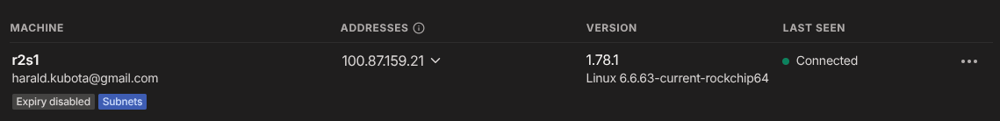

# Using TF (OpenTofu) to create a site-to-site VPN with AWS

The example creates:

* A security group which allows incoming SSH and HTTP traffic (and any outgoing traffic)
* a private VPC
* an EC2 instance with Linux in that private VPC
* a public VPC
* an EC2 instance with Linux in that private VPC
* a DNS entry for the latter in CloudFlare

## Pre-Requisites

* a network at home (AKA on-premise)
* a machine on the on-premise network which is in Tailscale and which advertises the local network. My IP for this one is 192.168.45.39.
* AWS CLI installed and configured
* OpenTofu installed
* In your AWS account, remove the default subnets. You'll create new ones.
* a .env file containing API tokens, like:
```
export TF_VAR_cloudflare_dns_id="YOUR_ZONE_ID"
export TF_VAR_cloudflare_api_token="YOUR_API_TOKEN"
```

This is what you should see in the Tailscale management console:



## Using OpenTofu to build AWS Infrastructure

Build the infrastructure in AWS:

```
❯ source .env
❯ tofu -chdir=tailscale workspace select prod
❯ tofu -chdir=tailscale apply -auto-approve
[...]

Outputs:

cloudflare_dns = "tsgw-prod.mydomain.org"
instance_ips = "ec2-13-112-16-13.ap-northeast-1.compute.amazonaws.com"
```

You now have 2 EC2 instances: one in a private network (172.31.2.0/24)
which is the representative of all EC2
instances in private subnets,
and one in a public subnet (172.31.1.0/24) which contains the Tailscale gateway.

Connect to the AWS Tailscale gateway with the SSH key you supplied (in main.tf):

```
❯ ssh -i ~/.ssh/aws ec2-user@ec2-13-112-16-13.ap-northeast-1.compute.amazonaws.com
   ,     #_
   ~\_  ####_        Amazon Linux 2023
  ~~  \_#####\
  ~~     \###|
  ~~       \#/ ___   https://aws.amazon.com/linux/amazon-linux-2023
   ~~       V~' '->
    ~~~         /
      ~~._.   _/
         _/ _/
       _/m/'
[ec2-user@ip-172-31-1-204 ~]$ 
```

# On AWS Tailscale GW instance

Install and configure Tailscale on the GW instance (the EC2 in the public subnet) and advertise the internal subnets in the VPC:

```
❯ echo 'net.ipv4.ip_forward = 1' | sudo tee -a /etc/sysctl.d/99-tailscale.conf
❯ echo 'net.ipv6.conf.all.forwarding = 1' | sudo tee -a /etc/sysctl.d/99-tailscale.conf
❯ sudo sysctl -p /etc/sysctl.d/99-tailscale.conf
❯ curl -fsSL https://tailscale.com/install.sh | sh
❯ sudo tailscale up --advertise-routes=172.31.0.0/16 --accept-routes

To authenticate, visit:

        https://login.tailscale.com/a/1axxxxxxxxxxxx

Success.
❯ sudo systemctl enable --now tailscaled
❯ 
```


Advertise all networks in your subnets you like to be connectable via Tailscale. You can select specific ones, e.g. only the private networks. Simply adjust the advertised routes.

In a browser on any computer:

* Open a browser for above URL, authenticate and approve.
* Go to the Tailscale management console and disable key expiry


* and approve the route


* By now you should see 2 machines with subnets and expiry disabled:
 * your gateway on-prem you had before and
 * the AWS Tailscale gateway

And this is after approving the route advertising and the expiry is disabled:


## Verify Tailscale routes

On the on-premises Tailscale GW you can see the route to AWS:

```
harald@r2s1:~$ ip route show table 52
100.81.88.125 dev tailscale0 
100.100.100.100 dev tailscale0 
172.31.0.0/16 dev tailscale0 
```

and on the AWS Tailscale GW the same for the on-prem network:

```
[ec2-user@ip-172-31-1-227 .ssh]$ ip route show table 52
100.87.159.21 dev tailscale0 
100.100.100.100 dev tailscale0 
192.168.45.0/24 dev tailscale0 
```

## Routing on-prem

If your default router is not the Tailscale gateway, your hosts on your on-prem network need to know how to reach 172.31.0.0/16. Thus for on-prem hosts execute the following command to add a route to the AWS VPC via the on-prem Tailscale gateway:

```
sudo ip route add 172.31.0.0/16 via 192.168.45.39
```
with 192.168.45.39 being the on-prem Tailscale gateway.
The routing on the AWS side is handled via its routing tables which are set via TF.

## Testing it

At this point you can connect via ssh from either gateway to any hosts on
the other network using their local IP (172.310.0/16 and 192.168.45.0/24).
E.g. connecting to the private subnet EC2 instance:

```
❯ ssh -i ~/.ssh/aws ec2-user@172.31.2.128
   ,     #_
   ~\_  ####_        Amazon Linux 2023
  ~~  \_#####\
  ~~     \###|
  ~~       \#/ ___   https://aws.amazon.com/linux/amazon-linux-2023
   ~~       V~' '->
    ~~~         /
      ~~._.   _/
         _/ _/
       _/m/'
Last login: Sun Jan 26 08:49:14 2025 from 172.31.1.204
[ec2-user@ip-172-31-2-128 ~]$ 
```

and it works equally from the private subnet EC2 instance to a on-prem Linux machine:

```
[ec2-user@ip-172-31-2-128 ~]$ ssh harald@192.168.45.40
harald@192.168.45.40's password: 
Welcome to Ubuntu 24.04.1 LTS (GNU/Linux 6.8.0-51-generic x86_64)

 * Documentation:  https://help.ubuntu.com
 * Management:     https://landscape.canonical.com
 * Support:        https://ubuntu.com/pro

 System information as of Sun Jan 26 06:07:23 PM JST 2025

  System load:             0.09
  Usage of /home:          52.4% of 245.02GB
  Memory usage:            30%
  Swap usage:              0%
  Temperature:             43.0 C
  Processes:               143
  Users logged in:         1
  IPv4 address for enp1s0: 192.168.45.40
[...]

Last login: Sun Jan 26 17:48:30 2025 from 192.168.45.39
```

## Future Improvements

* Install Tailscale and configure automatically
* Maybe create an AMI with a fully working Tailscale setup
